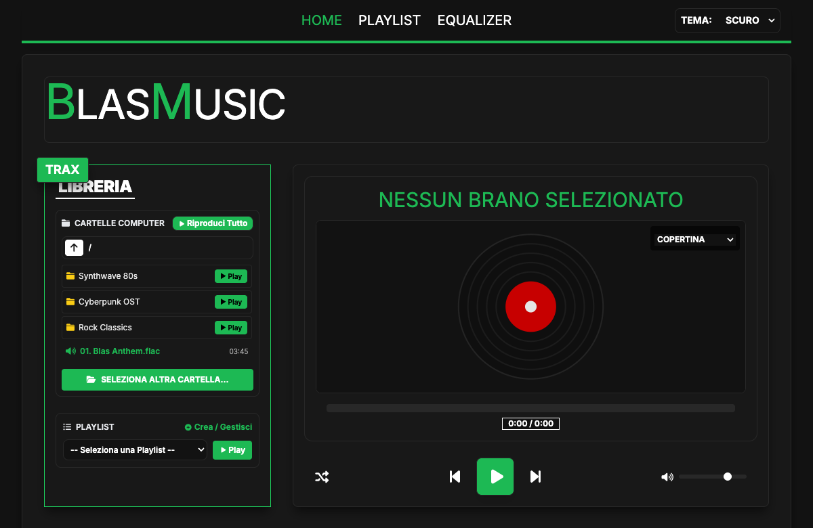
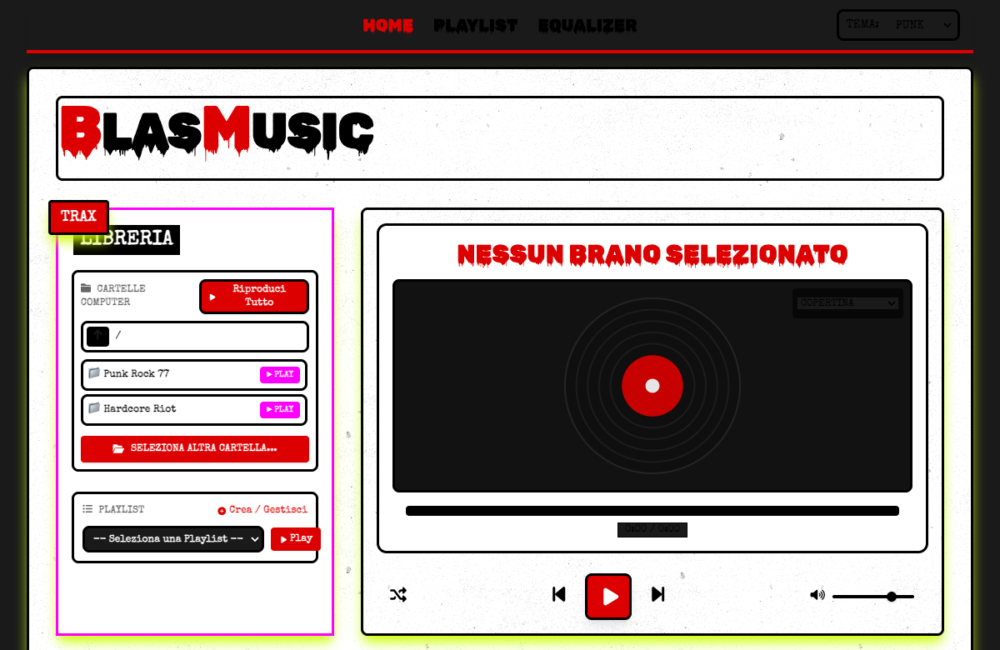
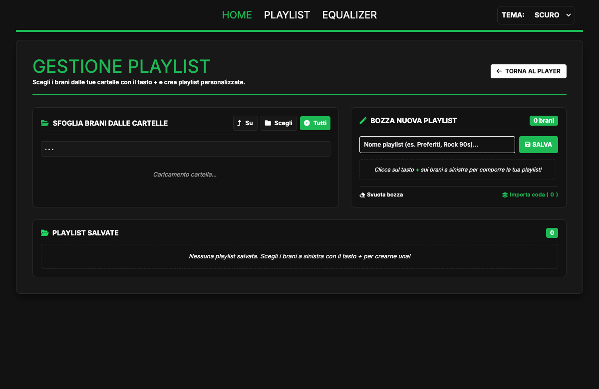

# 🎵 BlasMusicPlayer


**BlasMusicPlayer** è un riproduttore musicale desktop moderno, nativo, ultra-leggero e rigorosamente conforme ai principi **Local-First & Zero-Terminal** dell'ecosistema **[BlasOpen](../../COSTITUZIONE.md)**.

Combina la velocità e la sicurezza di un backend nativo in **Rust** (su architettura **Tauri 2.0**) con la fluidità e l'eleganza grafica della **Web Audio API** e del rendering hardware accelerato a 60 FPS, garantendo un consumo di RAM minimo (30-50 MB) e l'assenza totale di abbonamenti, pubblicità o telemetria.

---

## ✨ Caratteristiche Principali

* **Regola Zero-Terminal:** Nessun interprete esterno da installare o comando da digitare. Si avvia istantaneamente con un doppio clic su `BlasMusicPlayer.app` o tramite lo script `./blasmusicplayer`.
* **Navigazione Cartelle & Play Sottocartelle:** Esplora la tua musica locale liberamente. Ogni cartella o sottocartella include un pulsante Play rapido per ascoltarne direttamente l'intero contenuto.
* **Sistema Playlist Persistente:** Crea, personalizza e conserva le tue playlist in locale. Pagina dedicata con navigazione a cartelle e pulsante `+` per comporre playlist traccia per traccia.
* **Memoria di Stato Automatica:** L'applicazione ricorda sempre l'ultima cartella esplorata, riaprendola immediatamente all'avvio.
* **Metadati e Copertine Native:** Analisi binaria ad alte prestazioni con la crate Rust `lofty`: visualizzazione in tempo reale di Artista, Titolo e Cover Art originale embedded.
* **Visualizzatore Audio a 60 FPS:** Analizzatore di spettro (Barre), Forma d'onda (Oscilloscopio), Anelli d'onda reattivi e Vinile rotante animato.
* **Equalizzatore Master a 3 Bande:** Bassi, Medi, Alti e processamento dinamico senza latenza.
* **Doppio Tema Grafico:** Look *Modern Dark* (stile Spotify) e look *Punk Acid* con lo sfondo leopardato originale (`.leopard-bg`) e accenti al neon.

---

## 📸 Interfaccia e Funzionalità

### 🟢 1. Tema Modern Dark (Player & Esplorazione Cartelle)
Interfaccia elegante in stile Spotify con navigazione rapida delle cartelle del computer, pulsante Play rapido per riprodurre all'istante le sottocartelle, disco in vinile rotante animato e coda di riproduzione.



### 🐆 2. Tema Punk Acid (con Sfondo Leopardato)
Estetica audace anni '80 con lo sfondo leopardato iconico (`.leopard-bg`) nella libreria laterale, texture in stile carta vissuta e accenti al neon giallo/fucsia.



### 📑 3. Compositore e Gestione Playlist
Schermata dedicata alla composizione e salvataggio delle playlist personali in locale: esplora i tuoi file musicali e aggiungi le canzoni con un click sul tasto `+`.



## 🚀 Download e Installazione (Zero-Terminal)

Puoi scaricare l'applicazione già compilata per il tuo sistema operativo direttamente dalla pagina delle **[Releases Ufficiali](https://github.com/maurobeltrami/BlasMusicPlayer/releases)**:

### 🍏 macOS (Apple Silicon M1/M2/M3/M4 & Intel)
1. Scarica il file **`BlasMusicPlayer_1.0.0_universal.dmg`**.
2. Trascina **BlasMusicPlayer** nella cartella **Applicazioni**.
3. **Primo avvio (macOS Gatekeeper):** Trattandosi di un software open-source gratuito (senza l'abbonamento annuale a pagamento per sviluppatori Apple da 99$/anno), macOS mostrerà l'avviso di sicurezza *"Apple non può verificare BlasMusicPlayer"*.
   * **Metodo Grafico:** Clicca su **Done/Annulla** ➔ Apri **Impostazioni di Sistema** ➔ **Privacy e sicurezza** ➔ scorri in basso fino a **Sicurezza** e clicca su **"Apri comunque"** (*Open Anyway*).
   * **Oppure da Terminale (rapido):**
     ```bash
     xattr -cr /Applications/BlasMusicPlayer.app
     ```

### 🪟 Windows
1. Scarica l'installer **`BlasMusicPlayer_1.0.0_x64-setup.exe`** (o il pacchetto `.msi`).
2. Avvia l'installazione guidata con un doppio clic.
3. **Primo avvio (Windows SmartScreen):** Se appare la schermata blu di protezione, fai clic su **"Ulteriori informazioni"** e poi seleziona **"Esegui comunque"**.

### 🐧 Linux (Ubuntu, Debian, Fedora, Arch)
1. Scarica il pacchetto **`.deb`** (per Ubuntu/Debian) oppure **`BlasMusicPlayer_1.0.0_amd64.AppImage`**.
2. Con l'AppImage, rendila eseguibile con un clic destro ➔ *Proprietà* ➔ *Permessi* ➔ *Consenti l'esecuzione* (oppure `chmod +x *.AppImage`) e fai doppio clic per avviare.

---

## 🛠️ Per gli Sviluppatori (Compilazione da sorgente)

```bash
# 1. Clona il repository
git clone https://github.com/maurobeltrami/BlasMusicPlayer.git
cd BlasMusicPlayer

# 2. Installa le dipendenze
npm install

# 3. Avvia l'applicazione in modalità sviluppo locale
npm run tauri dev

# 4. Compila i binari di produzione (.dmg, .app, .exe, .deb)
npm run tauri build
```

---

## 🏛️ Costituzione e Didattica BlasOpen

BlasMusicPlayer rispetta i principi di etica, privacy, modularità (limite tassativo di 150 righe per file di codice sorgente) e trasparenza didattica stabiliti nella:
* 📜 **[Costituzione dell'Ecosistema BlasOpen](../../COSTITUZIONE.md)**
* 📜 **[Regole del Progetto (AGENTS.md)](AGENTS.md)**
* 📚 **[Documentazione e Manuali Didattici](docs/)**
  * [01. Fondamenti Audio e Game Loop](docs/01_fondamenti_audio_e_gameloop.md)
  * [02. Gestione Tempo e Seek Bar](docs/02_gestione_tempo_e_seekbar.md)
  * [03. Architettura Playlist e Code](docs/03_architettura_playlist_e_code.md)
  * [04. Navigazione Filesystem e File Browser](docs/04_navigazione_filesystem_e_filebrowser.md)
  * [05. Modernizzazione UI e Temi Grafici](docs/05_modernizzazione_ui_e_temi_grafici.md)
  * [06. Architettura Moderna: Tauri 2.0 e IPC](docs/06_architettura_tauri_e_ipc.md)
  * [07. Gestione Metadati, Copertine e Playlist](docs/07_gestione_metadati_e_playlist_persistenti.md)
  * [Manuale Utente Ufficiale](docs/manuali/manuale_utente.md)
  * [Censimento Tecnologie Utilizzate](docs/tecnologie_utilizzate.md)

*(Nota didattica: il prototipo iniziale sviluppato in C++17 e Raylib 6.0 è interamente conservato e consultabile all'interno della cartella `legacy_cpp/`).*
